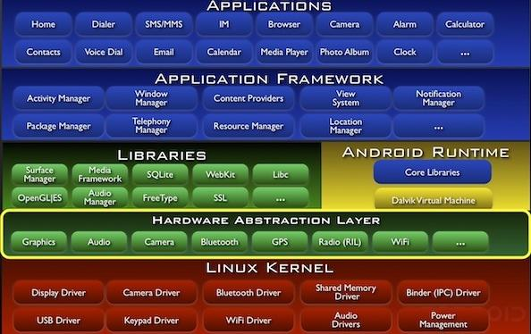

## Android介绍

### Android为什么这么特别？
首先我们想问的问题是，为什么要学习Android，是什么让Android这么特别？

1. Android是谷歌开源的免费的系统，它可以运行在手机、平板、电视甚至手表等任何的硬件平台上。一个平台，即可运行所有不同的设备！
2. 谷歌还为Android的研发提供一整套的免费工具，你可以在Mac、Win、Linux编译并运行你的程序，并且发布到市场上。

Android使用Java语言为首选开发语言，支持JavaSE的大多数特性，不支持AWT和Swing包。AndroidSDK拥有原生的UI框架，特别是5.0的发布，奠定了卡片式设计，6.0全面应用[Material Design](http://www.google.com/design/spec/material-design/)设计风格，围绕Material Design的一系列的开发指南、开发标准及控件都已经逐步完善。

下面附上一张经典的Android架构图。

![Android架构][./img/android-structure.jpg]
